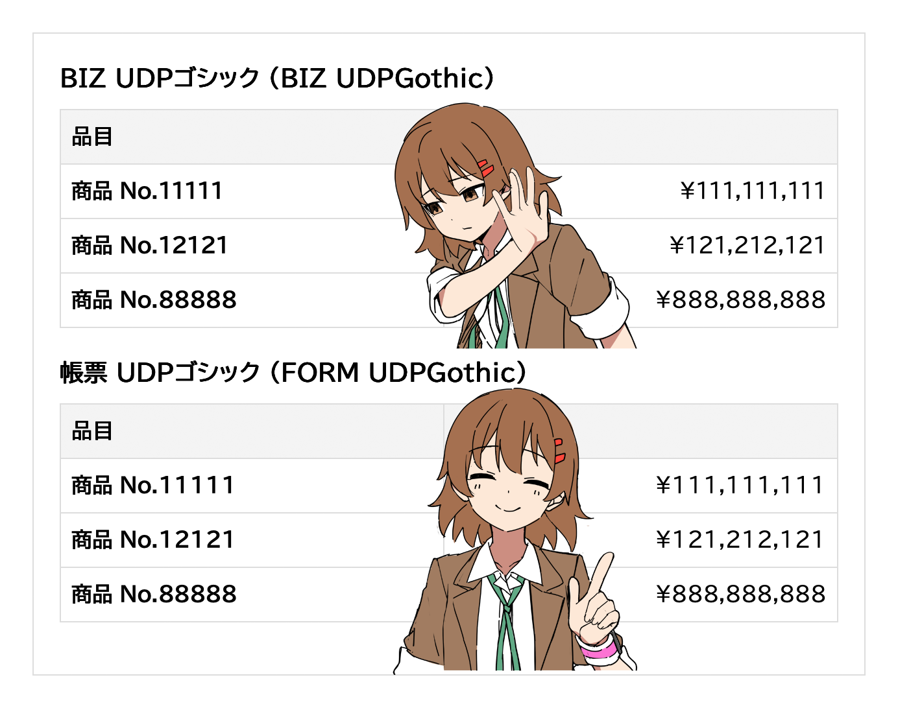

# 帳票 UDPゴシック (FORM UDPGothic)

**モリサワ [BIZ UDPゴシック](https://github.com/googlefonts/morisawa-biz-ud-gothic) (Version 1.051) の「1」と「１（全角）」の幅のみを変更し、数字（0〜9）を等幅にしたフォントです（※）。** 

「BIZ UDPゴシック」を使いたい！ でも、数字は等幅にしたい。でも、等幅の「BIZ UDゴシック」の数字は細すぎる！　というときに使えるフォントです。

「BIZ UDPゴシック」のグリフ数 13,932個のうち2個を変更し、残りの約 99.9856% のグリフは全く同じです。

※「BIZ UDPゴシック」は、0〜9 のうち 1 のみ幅（サイドベアリング）が異なる。

## Repository

* diff: [Diffenator 2](https://github.com/googlefonts/diffenator2) によるフォントの差分レポート
* original: [Morisawa BIZ UDGothic](https://github.com/googlefonts/morisawa-biz-ud-gothic) のコピー
* release: 帳票 UDPゴシック
* scripts: 生成スクリプトなど

## License

* フォント: [SIL Open Font License](https://openfontlicense.org/)
* scripts: [CC0](https://creativecommons.jp/sciencecommons/aboutcc0/)
