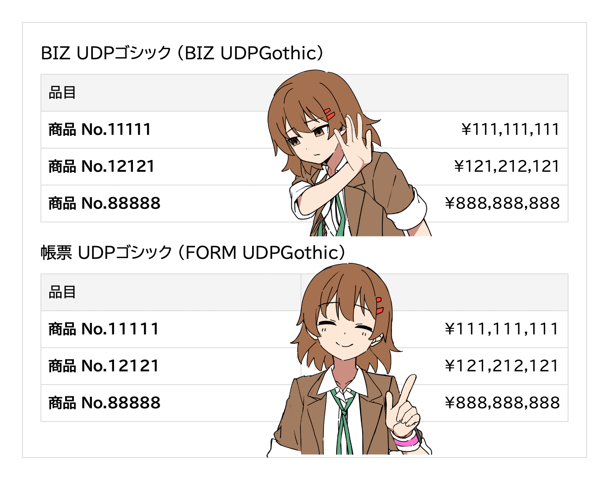

# 帳票 UDPゴシック (FORM UDPGothic)

**モリサワ [BIZ UDPゴシック](https://github.com/googlefonts/morisawa-biz-ud-gothic) の「1」と「１（全角）」の幅だけを変更して、0〜9を等幅にしたフォントです。** 等幅の BIZ UDゴシックの数字は細すぎる！というときに使えます。

※ BIZ UDPゴシックは、0〜9のうち1だけ幅が異なる。

## License

* フォント: [SIL Open Font License](https://openfontlicense.org/)
* scripts: [CC0](https://creativecommons.jp/sciencecommons/aboutcc0/)
